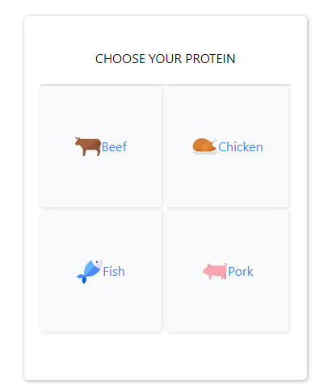
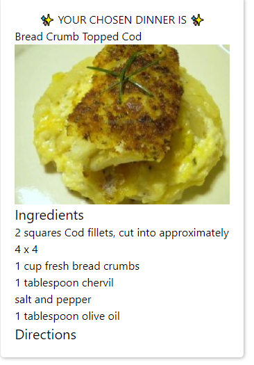

# Dinner and Drinks

Description:
Have you ever asked a friend or loved one what they want for dinner? Ever need help making a decision for what to make for dinner? This app helps eliminate guesswork by guiding you towards dinner and drink recipes based on your preference. We want to help our users plan a great evening by presenting great ideas for dinner and drinks. We want to scale this application to expand beyond recipes and branch out into restaurants and breweries.

### User story

```

As an end user I want help coming up with ideas for dinner and drinks
I want to be able to get meal ideas from the ingredients I have from my pantry
I want to be able to get different meal recipes based on what I have available
I want suggested drink recipes based on what I have in stock
I want each recipe to display a picture and a title
I want each recipe to display required ingredients
I want each recipe to display instructions for creating the recipe
```

### User Experience

1. Our users will log onto the app and be greated by two cards. One allowing them to pick their dinner, and the other for drinks.




2. Upon selecting a meal, the users will be presented with an ingredients list that fits in a mobile opitmized window.



3. If the user clicks on "Directions" an expanded recipe list appears


### URL: https://lelandcypress.github.io/What-is-for-dinner/

### APIs Used

- Meal Recipes: Spoonacular https://spoonacular.com/food-api
- Cocktail Recipes: TheCocktailDB API: https://www.thecocktaildb.com/api.php
- Beer: Punk API: https://punkapi.com/

### Technology Used:

- CSS Framework: Tailwind
- JS Framework: jQuery

### Product Roadmap

- Expand food and drink offerings to a wider audience.
- Enhance user search capabilities
- Nearby Activities search.
